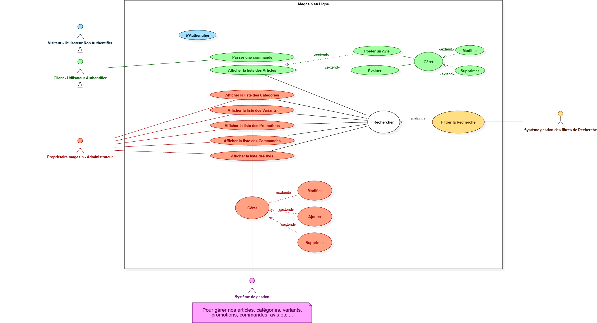
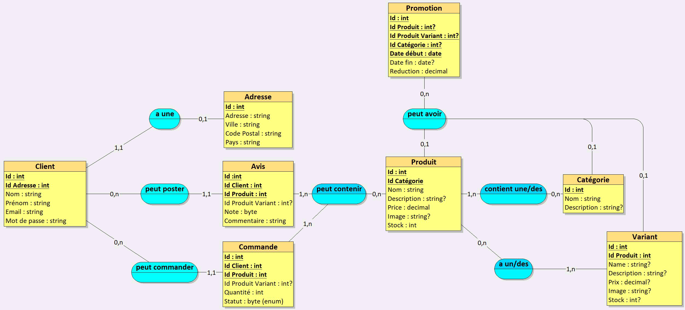
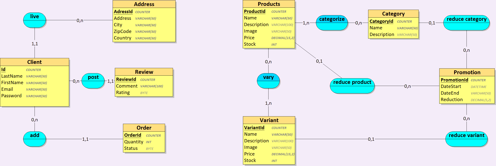
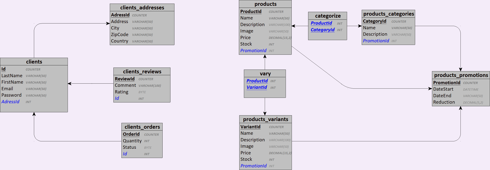

# Exercice Console C# .NET 7.0
* WebApi C# avec EntityFramework en multi-couche (couche application, couche métier, couche données).
 
### Contexte du projet
Une entreprise de magasin en ligne souhaite gérer efficacement ses stocks de produit, ajuster les prix , permettre aux clients de faire des commandes et de répondre aux besoins des clients de manière rapide et précise.

----------
# Rendu
<ol type="1">
	<li>
		

			
Diagramme de cas d'utilisation

			
		

	</li>
	<li>Diagramme MCD/MLD
		<ol type="1">
			<li>
				

					
MCD

					
				

			</li>
			<li>
				

					
MLD (en anglais pour que les champs générés en C# soient en anglais et respectent la convention de nommage de mon projet

					
					
				

			</li>
		</ol>
	</li>
	<li>Fichiers SQL dans le dossier SQL (PostgreSQL avec pgAdmin 4)</li>
</ol>